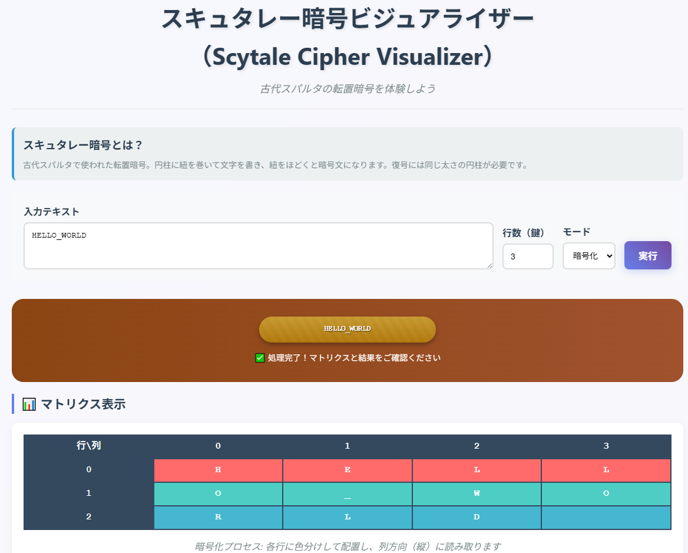

# スキュタレー暗号ビジュアライザー（Scytale Cipher Visualizer）

スキュタレー暗号の暗号化・復号をWebブラウザーで体験できる教育ツールです。

視覚的なアニメーションとインタラクティブなマトリクス表示により、転置暗号の仕組みを直感的に理解できます。

## 🌐 デモページ

👉 [GitHub Pagesで開く](https://ipusiron.github.io/scytale-cipher-visualizer/)

## 📸 スクリーンショット

以下は実際の画面例です。

>
>
> *初期画面*

## ✨ 特徴

### 🎯 教育的価値
- **視覚的理解**: マトリクス表示による暗号化・復号プロセスの可視化
- **歴史的背景**: 古代スパルタの軍事通信で実際に使われた暗号の再現
- **インタラクティブ**: リアルタイムでの操作とフィードバック

### 🎨 動的ビジュアル
- **スキュタレー円柱**: 行数（鍵）に応じて太さが変化
- **アニメーション効果**: 暗号化・復号時の紐の巻き取り/ほどき表現
- **8色カラーコーディング**: 各行を異なる色で表示し、処理過程を明確化

### 💻 技術仕様
- **Pure JavaScript**: 外部ライブラリ不要
- **レスポンシブデザイン**: モバイル・デスクトップ対応
- **モダンCSS**: Grid Layout、Flexbox、CSS Animation活用

## 📜 スキュタレー暗号について

### 🏛️ 歴史的背景

スキュタレー暗号（Scytale Cipher）は、紀元前5世紀頃の古代スパルタで軍事通信に使用された転置暗号です。

特定の太さの円柱（スキュタレー）に革紐を螺旋状に巻き、その上に平文を一列に書きます。
紐をほどくと文字がバラバラになり暗号文となり、同じ太さの円柱でのみ復号可能でした。

### 🔬 暗号学的分類

- **暗号方式**: 転置暗号（Transposition Cipher）
- **鍵**: 円柱の太さ（本ツールでは行数で表現）
- **強度**: 鍵の種類数は行数に依存（比較的弱い暗号）

## ⚙️ アルゴリズム詳細

### 🔒 暗号化プロセス
1. 平文を指定した行数（円柱の太さ）で折り返す。
2. 文字をマトリクス形式で行方向に配置する。
3. 列方向（縦）に読み取って暗号文を生成する。

```
例: "HELLO_WORLD" を 3行で暗号化
H E L L
O _ W O
R L D

列方向読み取り: H O R E _ L L W D L O
結果: "HOREL_LWDLO"
```

### 🔓 復号プロセス
1. 暗号文の長さと行数から列数を算出する。
2. 文字を列方向に分配してマトリクスを再構築する。
3. 行方向（横）に読み取って平文を復元する。

## 🎮 使用例

### 🔐 基本的な暗号化
```
入力: "SECRET_MESSAGE"
行数: 4
モード: 暗号化
結果: "SMEESR_SCEARGTE"
```

### 🔑 復号
```
入力: "SMEESR_SCEARGTE"
行数: 4
モード: 復号
結果: "SECRET_MESSAGE"
```

## 🛡️ セキュリティ分析

### 📊 強度評価

- **鍵空間**: 行数の選択肢（2-10行）= 9通り
- **脆弱性**: 総当たり攻撃に対して非常に弱い
- **頻度分析**: 文字の出現頻度は変わらないため統計的攻撃が有効

### 🎓 現代への応用
スキュタレー暗号自体は現代では実用的ではありませんが、転置暗号の基礎として重要です。

- **ブロック暗号**: 現代暗号の置換・転置操作の原理
- **教育価値**: 暗号学の基本概念の理解
- **歴史的意義**: 暗号技術の発展過程の学習

## 📁 プロジェクト構成

```
scytale-cipher-visualizer/
├── 📄 index.html          # メインページ
├── 📁 css/
│   └── 🎨 style.css       # スタイルシート
├── 📁 js/
│   └── ⚡ script.js       # JavaScript機能
├── 📁 assets/
│   └── 🎬 demo.gif        # デモ画像
├── 📖 README.md           # プロジェクト説明
├── 📜 LICENSE             # MITライセンス
└── 🚫 .gitignore          # Git除外設定
```

## 🚀 クイックスタート

### 🌐 オンライン版

👉 [GitHub Pagesで開く](https://ipusiron.github.io/scytale-cipher-visualizer/)

### 💾 ローカル実行

```bash
# リポジトリをクローン
git clone https://github.com/ipusiron/scytale-cipher-visualizer.git
cd scytale-cipher-visualizer

# 任意のWebサーバーで実行
python -m http.server 8000
# または
npx serve .

# ブラウザで http://localhost:8000 にアクセス
```

## 📄 ライセンス

MIT License - 詳細は [LICENSE](LICENSE) ファイルを参照

## 🔗 関連リンク

- 🎓 [暗号技術について（akademeia.info）](https://akademeia.info/category/crypto/)
- 📜 [古典暗号の歴史](https://en.wikipedia.org/wiki/Classical_cipher)
- 🔄 [転置暗号の種類](https://en.wikipedia.org/wiki/Transposition_cipher)

## 🌐 ブラウザサポート

- ✅ **Chrome** 60+
- ✅ **Firefox** 55+
- ✅ **Safari** 11+
- ✅ **Edge** 79+

### ⚠️ 免責事項
**Educational Purpose**: このツールは暗号学の教育目的で作成されています。実際のセキュリティ用途での使用は推奨されません。

## 🔥 このツールについて

本ツールは、「生成AIで作るセキュリティツール100」プロジェクトの一環として開発されました。 このプロジェクトでは、AIの支援を活用しながら、セキュリティに関連するさまざまなツールを100日間にわたり制作・公開していく取り組みを行っています。

プロジェクトの詳細や他のツールについては、以下のページをご覧ください。

🔗 [https://akademeia.info/?page_id=42163](https://akademeia.info/?page_id=42163)
