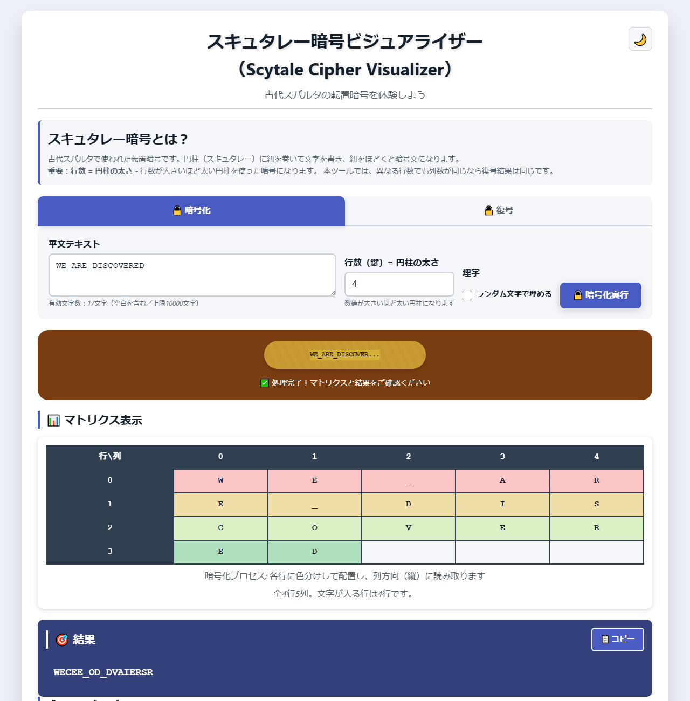
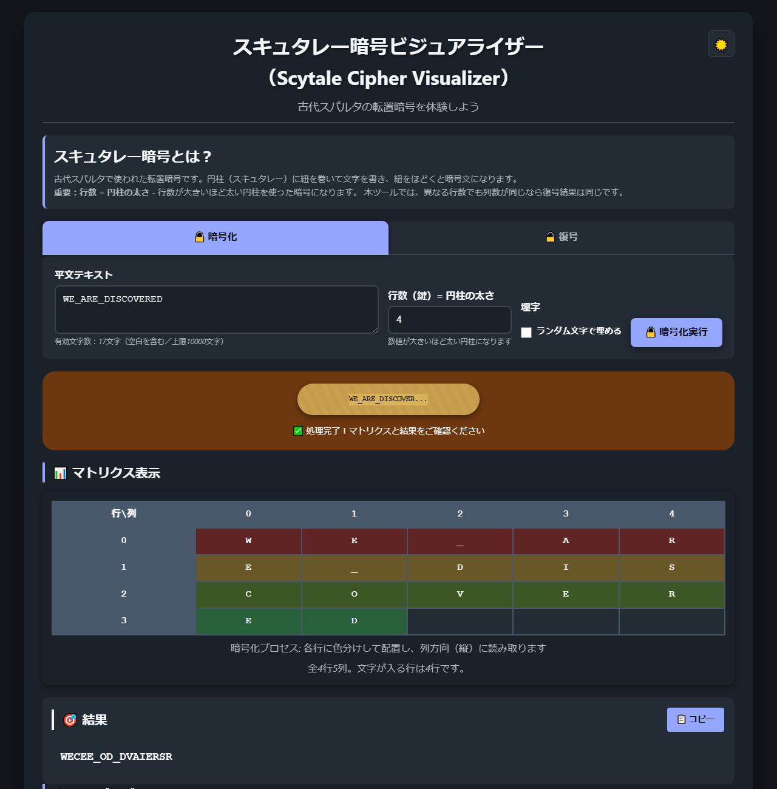
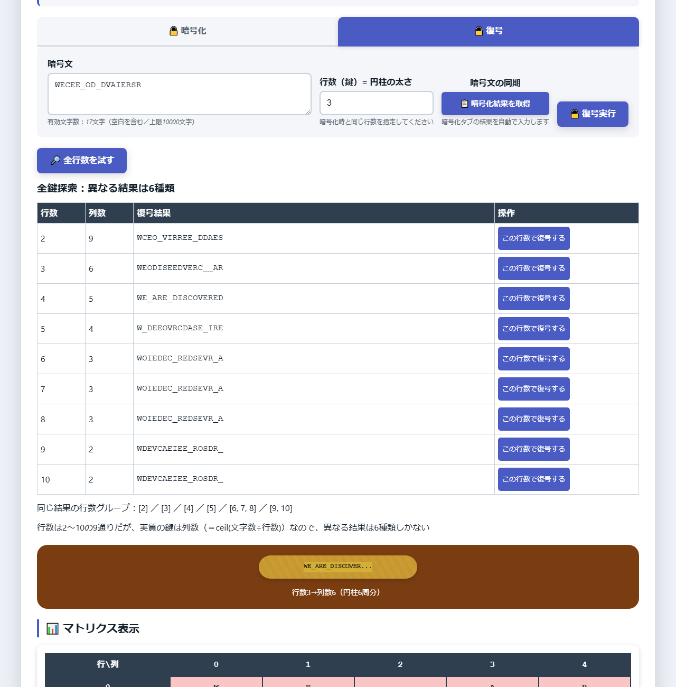

<!--
---
id: day010
slug: scytale-cipher-visualizer

title: "Scytale Cipher Visualizer"

subtitle_ja: "スキュタレー暗号ビジュアライザー"
subtitle_en: "Ancient Spartan Transposition Cipher Simulator"

description_ja: "古代スパルタのスキュタレー暗号をWebブラウザーで体験できる教育ツール。マトリクスとアニメーション、全鍵探索、ダークモードで転置暗号の仕組みと限界を学べます。"
description_en: "Learn the Spartan Scytale transposition cipher with matrix visualization, animations, brute-force decryption, and dark mode."

category_ja:
  - 古典暗号
  - 転置式暗号
category_en:
  - Classical Cryptography
  - Transposition Cipher

difficulty: 1

tags:
  - visualization
  - educational
  - scytale-cipher
  - transposition-cipher
  - brute-force

repo_url: "https://github.com/ipusiron/scytale-cipher-visualizer"
demo_url: "https://ipusiron.github.io/scytale-cipher-visualizer/"

hub: true
---
-->

# Scytale Cipher Visualizer - スキュタレー暗号ビジュアライザー

[English](README.en.md) · 日本語

[](https://github.com/ipusiron/scytale-cipher-visualizer/stargazers)
[](https://github.com/ipusiron/scytale-cipher-visualizer/network/members)
[](https://github.com/ipusiron/scytale-cipher-visualizer/commits/main)
[](LICENSE)
[](https://ipusiron.github.io/scytale-cipher-visualizer/)

**Day010 - 生成AIで作るセキュリティツール100**

スキュタレー暗号の暗号化・復号をWebブラウザーで体験できる教育ツールです。

視覚的なアニメーションとインタラクティブなマトリクス表示により、転置暗号の仕組みを直感的に理解できます。

## 🌐 デモページ

👉 [GitHub Pagesで開く](https://ipusiron.github.io/scytale-cipher-visualizer/)

## 📸 スクリーンショット

以下は実際の画面例です。


> *WE_ARE_DISCOVEREDを行数4・埋字なしで暗号化したマトリクスと結果*


> *同じ暗号化結果をダークモードで表示*


> *行数2〜10の9候補を比較し、異なる復号結果が6種類であることを確認*

## ✨ 機能

### 🎯 教育的価値

- **視覚的理解**: マトリクス表示による暗号化・復号プロセスの可視化
- **歴史的背景**: 古代スパルタの軍事通信で実際に使われた暗号の再現
- **インタラクティブ**: リアルタイムでの操作とフィードバック
- **タブ分離**: 暗号化と復号を独立したタブで明確に区別

### 🎨 動的ビジュアル

- **スキュタレー円柱**: 行数（鍵）に応じて太さが変化
- **アニメーション効果**: 暗号化・復号時の紐の巻き取り/ほどき表現
- **8色カラーコーディング**: 各行を異なる色で表示し、処理過程を明確化
- **ワンクリック同期**: 暗号化結果を復号タブに自動転送

### 💻 技術仕様

- **Pure JavaScript**: 外部ライブラリー不要
- **レスポンシブデザイン**: モバイル・デスクトップ対応
- **モダンCSS**: Grid Layout、Flexbox、CSS Animation活用
- **セキュリティ強化**: XSS対策、CSP設定、入力サニタイゼーション
- **全鍵探索**: 行数2〜10の9候補を表示し、同じ結果の行数をグループ化
- **文字の保持**: 空白・日本語・絵文字をコードポイント単位で処理
- **ダークモード**: OS設定に追従し、手動切り替えも可能
- **日本語・英語の切り替え**: ヘッダー左上のボタンで切り替え。`?lang=en`の指定とブラウザー設定にも追従

## 📖 使い方

### 🔒 暗号化タブでの操作

1. **平文入力**: 暗号化したいテキストを入力
2. **行数設定**: 円柱の太さ（2-10行）を指定
3. **埋字オプション**: 必要に応じてランダム文字での埋字を有効化
4. **実行**: 「🔒 暗号化実行」ボタンをクリック

### 🔓 復号タブでの操作

1. **暗号文入力**: 手動入力または「📋 暗号化結果を取得」で自動同期
2. **行数設定**: 暗号化時と同じ行数を指定（同期時は自動設定）
3. **実行**: 「🔓 復号実行」ボタンをクリック
4. **全鍵探索**: 行数が不明なら「🔎 全行数を試す」をクリック
5. **候補の確認**: 「この行数で復号する」で通常の復号結果とマトリクスを表示

### 💡 暗号文同期機能

- 暗号化タブで実行後、復号タブの「📋 暗号化結果を取得」をクリック
- 暗号文と行数が自動で復号タブに転送される
- すぐに復号を実行して元の平文を確認可能

### 📋 使用例
```
【暗号化タブ】
入力: "SECRET_MESSAGE"
行数: 4
結果: "SEEGETSEC_SRMA"

【復号タブ（同期後）】
入力: "SEEGETSEC_SRMA" (自動設定)
行数: 4 (自動設定)
結果: "SECRET_MESSAGE"
```

## 📐 画面構成

- **暗号化／復号タブ**: 独立した入力欄・有効文字数・行数と実行ボタン
- **円柱表示**: 行数に応じた太さ、列数（円柱の周数）、巻き取り／ほどきアニメーション
- **マトリクス**: 行色・埋字・空セルを区別。先頭60列のみ表示し、結果は全文表示
- **列ハイライト**: マウスのホバー、クリック、セルにフォーカスしてEnter／Spaceで切り替え
- **結果**: 連続空白を保持した全文とコピーボタン。恒等となる設定には警告
- **全鍵探索**: 9行の候補表、同じ結果の行数グループ、異なる結果の数
- **テーマ**: ヘッダー右上で切り替え。テーマと言語の選択のみローカルに保存
- **言語**: ヘッダー左上で日本語と英語を切り替え。入力や結果があるままでも内容は消えない

## 🎯 ユースケース

- 転置暗号の暗号化・復号を授業や勉強会で説明
- 空白や日本語・絵文字の並べ替えを体験
- 全鍵探索により小さな鍵空間と同値な鍵を確認

### 暗号としての限界

### 📊 強度評価

- **鍵空間**: 行数は2〜10の9通りだが、実質の鍵は列数（`ceil(文字数÷行数)`）
- **脆弱性**: 総当たり攻撃に対して非常に弱い
- **頻度分析**: 文字の出現頻度は変わらないため統計的攻撃が有効

同じ列数になる行数では同じ復号結果になります。下表は異なる文字で構成した暗号文での結果です。
この範囲では3〜9種類ですが、1文字の入力や同じ文字の繰り返しでは1種類になることもあります。

| 暗号文の文字数 | 6 | 8 | 10 | 11 | 14 | 17 | 20 | 30 | 50 | 100 |
| --- | --- | --- | --- | --- | --- | --- | --- | --- | --- | --- |
| 異なる復号結果の数 | 3 | 4 | 5 | 4 | 5 | 6 | 6 | 7 | 9 | 9 |

`ATTACK_AT_DAWN`（14文字）を行数5で暗号化した`AA__WTCADNTKTA`は、行数5と6のどちらでも正しく復号できます。
いずれも列数が3だからです。行数を増やすほど強くなるわけではなく、行数が文字数以上なら列数は1となり、埋字なしでは平文と同じになります。

| 全鍵探索の暗号文 | 異なる結果の数 | 正解の行数 | 復号結果 |
| --- | ---: | --- | --- |
| `HORE_LLWDLO` | 4 | 3 | `HELLO_WORLD` |
| `AA__WTCADNTKTA` | 5 | 5, 6 | `ATTACK_AT_DAWN` |
| `WECEE_OD_DVAIERSR` | 6 | 4 | `WE_ARE_DISCOVERED` |
| `ACEBDF` | 3 | 3, 4, 5 | `ABCDEF` |

### 🎓 現代への応用
スキュタレー暗号自体は現代では実用的ではありませんが、転置暗号の基礎として重要です。

- **ブロック暗号**: 現代暗号の置換・転置操作の原理
- **教育価値**: 暗号学の基本概念の理解
- **歴史的意義**: 暗号技術の発展過程の学習

## 🔬 技術的な説明

### 🔒 暗号化プロセス

1. 平文を指定した行数（円柱の太さ）で折り返す。
2. 文字をマトリクス形式で行方向に配置する。
3. 列方向（縦）に読み取って暗号文を生成する。

```
例: "HELLO_WORLD" を 3行で暗号化
H E L L
O _ W O
R L D

列方向読み取り: H O R E _ L L W D L O
結果: "HORE_LLWDLO"
```

### 🔓 復号プロセス

1. 暗号文の長さと行数から列数を算出する。
2. 元の平文が存在したセルだけへ文字を列方向に分配してマトリクスを再構築する。
3. 行方向（横）に読み取って平文を復元する。

文字数をn、指定行数をrowsとすると、列数は`cols = ceil(n / rows)`です。
復号時はセル`(r, c)`の位置が`r * cols + c < n`を満たす場合だけ文字を置きます。
最後の行や下部の空行を飛ばすことで、埋字なしの暗号化と復号が厳密な逆写像になります。

### 検証済みの暗号化例

バッククォート内の前後の空白も文字に含みます。

| 平文 | 行数 | 暗号文 |
| --- | ---: | --- |
| `HELLO_WORLD` | 3 | `HORE_LLWDLO` |
| `SECRET_MESSAGE` | 4 | `SEEGETSEC_SRMA` |
| `ATTACK_AT_DAWN` | 5 | `AA__WTCADNTKTA` |
| `WE_ARE_DISCOVERED` | 4 | `WECEE_OD_DVAIERSR` |
| `ABCDEFGHIJ` | 3 | `AEIBFJCGDH` |
| `ABCD` | 3 | `ACBD` |
| `日本語のテスト文字列` | 3 | `日テ字本ス列語トの文` |
| `😀😃😄😁ABCD` | 3 | `😀😁C😃AD😄B` |
| `🔐SECRET🔑` | 3 | `🔐CTSR🔑EE` |
| `  SPACED  TEXT  ` | 3 | ` EX DTS  P  ATCE` |
| `A B C D` | 2 | `AC  BD ` |
| `AB` | 5 | `AB` |
| `ABCDE` | 10 | `ABCDE` |

### 埋字と入力の扱い

埋字を有効にすると、A〜Zのランダム文字で空セルを埋め、rows×colsの矩形にします。
`crypto.getRandomValues`の値を使い、234以上を捨てて26文字への剰余バイアスを避けます。
復号しても埋字は末尾に残るため、除去する範囲は利用者が判断してください。

制御文字・改行・タブは除去しますが、前後や途中の半角・全角空白は1文字として暗号化します。
1文字は1コードポイントであり、結合絵文字（ZWJシーケンス）や結合文字は分解される場合があります。
上限は除去後の10000文字、行数は2〜10の整数です。

### スキュタレー暗号の背景

#### 🏛️ 歴史的背景

スキュタレー暗号（Scytale Cipher）は、紀元前5世紀頃の古代スパルタで軍事通信に使用された転置暗号です。

特定の太さの円柱（スキュタレー）に革紐を螺旋状に巻き、その上に平文を一列に書きます。
紐をほどくと文字がバラバラになり暗号文となり、同じ太さの円柱でのみ復号可能でした。

#### 🔬 暗号学的分類

- **暗号方式**: 転置暗号（Transposition Cipher）
- **鍵**: 円柱の太さ（本ツールでは行数で表現）
- **強度**: 鍵の種類数は行数に依存（比較的弱い暗号）

## 🔒 セキュリティ

入力と結果はブラウザー内で処理し、外部APIへの送信や保存はしません。
`localStorage`に保存するのはテーマと言語の選択だけで、入力や結果は保存しません。
`textContent`による安全な描画を使い、入力をHTMLとして解釈しません。
CSPをmetaで設定し、スクリプトとスタイルを同一配信元に限定しています。
`object-src 'none'`・`base-uri 'self'`・`form-action 'self'`も指定しています。
metaでは`frame-ancestors`が無効なため設定していません。referrerは`no-referrer`です。

## ⚠️ 注意

このツールは暗号学の教育目的で作成されています。実際のセキュリティ用途には使わないでください。
埋字は暗号の安全性を保証しません。復号後に埋字を自動削除することもありません。
動きを減らす設定では処理待ちとアニメーションを停止しますが、通常設定では円柱の回転を表示します。

## 🧪 テスト

Node 22以上で`npm test`を実行します。`node --test`を使い、依存パッケージは不要です。
GitHub Actionsでもpushとpull_requestのたびに自動実行します。
既知解答13例、英数字558通り・日本語と絵文字432通りの往復、全鍵探索、入力境界、配色、HTML、整形を検証します。
READMEの表の暗号文・鍵空間の数値・画像参照とYAMLの構造もテスト対象です。
日英の辞書についても、キーの集合・差し込み名の一致・訳し忘れ・純ロジックに和文が残っていないことを検証します。

```bash
npm test
```

## 🔗 参考

- 🎓 [暗号技術について（akademeia.info）](https://akademeia.info/category/crypto/)
- 📜 [古典暗号の歴史](https://en.wikipedia.org/wiki/Classical_cipher)
- 🔄 [転置暗号の種類](https://en.wikipedia.org/wiki/Transposition_cipher)

## 🔄 更新履歴

### v2.2.0（2026-09-28）

- 日本語と英語の切り替えを追加（`js/i18n.js`、`?lang=`・保存値・ブラウザー設定に対応）
- マトリクス・全鍵探索・円柱の状態・コピー通知を、言語切り替え時に訳し直すよう変更
- 検証エラーを文言ではなく辞書のキーで返すよう`js/scytale-logic.js`を変更
- `README.en.md`と`test/i18n.test.js`を追加

### v2.1.0（2026-09-19）

- 不完全な矩形の復号と日本語・絵文字・空白の保持を修正
- 全鍵探索・同値な行数グループ・恒等警告・60列上限を追加
- ライト／ダークの配色、キーボード操作、CSP、テストとCIを整備

### v2.0.0

- **タブ機能**: 暗号化と復号を独立したタブで分離
- **暗号文同期**: ワンクリックで暗号化結果を復号タブに転送
- **セキュリティ強化**: XSS対策、CSP設定、入力サニタイゼーション
- **UI改善**: より直感的なインターフェイス設計

### v1.0.0

- 基本的な暗号化・復号機能
- スキュタレー視覚化
- マトリクス表示
- レスポンシブデザイン

## 📁 ディレクトリー構造

```
scytale-cipher-visualizer/
├── index.html              # タブ・フォーム・状態通知
├── css/style.css           # ライト／ダーク配色と円柱アニメーション
├── js/
│   ├── i18n.js              # 日本語・英語の辞書と切り替え
│   ├── scytale-logic.js     # DOMに依存しない暗号ロジック
│   └── script.js            # 画面操作とマトリクス描画
├── assets/
│   ├── favicon.svg          # 円柱アイコン
│   ├── screenshot.png       # 旧画像（保存）
│   └── screenshot2.png〜screenshot4.png  # 現行画面3枚
├── screenshot.png          # 旧画像（保存）
├── test/                   # 7ファイルの自動テスト（test/i18n.test.jsを含む）
├── .github/workflows/test.yml  # Node 22でのCI
├── package.json            # npm testの定義（依存なし）
├── README.md               # 使い方と検証済みの例
├── README.en.md            # 英語版README
├── CLAUDE.md               # 開発時の指示書
├── LICENSE                 # MITライセンス
└── .gitignore              # Git除外設定
```

### 🔧 主要機能とファイル構成

**index.html**
- タブナビゲーション（暗号化/復号タブ）
- 各タブの独立した入力フォーム
- CSP（Content Security Policy）設定

**script.js** 
- タブ切り替え機能
- 暗号文同期機能
- textContentによる安全な描画
- 全鍵探索の表示とテーマ切り替え

**scytale-logic.js**
- 入力値検証・サニタイゼーション（文言を持たず、辞書のキーと差し込み値を返す）
- コードポイント単位の暗号化・復号・全鍵探索

**i18n.js**
- 日本語・英語の辞書と`t()`による差し込み
- `data-i18n`属性の適用、`?lang=`・`localStorage`・ブラウザー設定からの言語決定

**style.css**
- レスポンシブタブデザイン
- グラデーション効果
- アニメーション（スキュタレー円柱、マトリクス）

## 💻 動作環境

Chrome・Edge・Firefox・Safariなどのモダンブラウザーを対象としています。
`index.html`をfile://で直接開いても動きます。Node 22以上が必要なのはテスト実行時だけです。

### 🌐 オンライン版

👉 [GitHub Pagesで開く](https://ipusiron.github.io/scytale-cipher-visualizer/)

### 💾 ローカル実行

```bash
# リポジトリーをクローン
git clone https://github.com/ipusiron/scytale-cipher-visualizer.git
cd scytale-cipher-visualizer

# 任意のWebサーバーで実行
python -m http.server 8000
# ブラウザーでhttp://localhost:8000にアクセス
```

## 📄 ライセンス

このプロジェクトは[MITライセンス](LICENSE)の下で公開されています。

## 🛠 このツールについて

本ツールは、「生成AIで作るセキュリティツール100」プロジェクトの一環として開発されました。 このプロジェクトでは、AIの支援を活用しながら、セキュリティに関連するさまざまなツールを100日間にわたり制作・公開していく取り組みを行っています。

プロジェクトの詳細や他のツールについては、以下のページをご覧ください。

🔗 [https://akademeia.info/?page_id=42163](https://akademeia.info/?page_id=42163)
